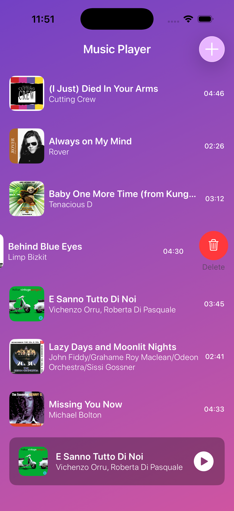
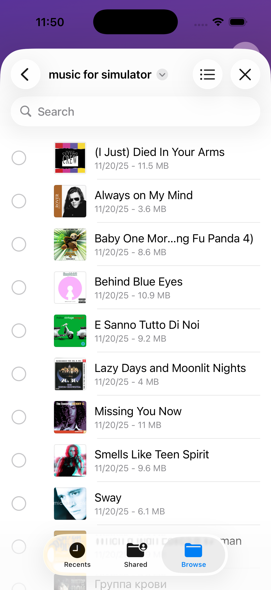

# 🎵 MusicPlayer

**MusicPlayer** — простое, современное iOS-приложение для воспроизведения аудио. Поддерживает:  

- Просмотр списка песен  
- Мини-плеер и полноэкранный плеер  
- Импорт аудио через файловый диалог  
- Поддержку **iOS 15+ и 17+**  

Проект представлен в двух вариантах:  

1. **Realm** — классическая база данных Realm для хранения песен.  
2. **SwiftData** — современный SwiftData с возможностью **externalStorage** для больших mp3 файлов.

---

## 🔹 Скриншоты

  
  
  

---

## 🔹 Возможности

- Список песен с названием, исполнителем и обложкой  
- Мини-плеер с возможностью разворачивания  
- Полноэкранный плеер с прогрессом и кнопками вперед/назад  
- Импорт mp3 файлов через `UIDocumentPicker`  
- Предотвращение дублирования песен при импорте  
- Поддержка **ExternalStorage** в SwiftData  

---

## 🔹 Технологии

- Swift 5.9+  
- SwiftUI  
- AVKit / AVAudioPlayer  
- SwiftData (`@Model`, `@Attribute(.externalStorage)`)  
- RealmSwift (для версии с Realm)  
- Combine (для отслеживания прогресса воспроизведения)  

---

## 🔹 Установка

### Realm версия (iOS 15+)
1. Установите зависимости через Swift Package Manager:  
   - `RealmSwift` версии `14.14.0` (для iOS 16+) или `10.43.0-10.48.0` для iOS 15  
2. Скопируйте код из BRANCH `RealmVersion`  
3. Запустите проект на симуляторе или устройстве  

### SwiftData версия (iOS 17+)
1. Xcode 15+ с поддержкой SwiftData  
2. Скопируйте код из BRANCH `SwiftDataVersion`  
3. Все mp3 файлы будут храниться во внешнем хранилище, база хранит только путь  

---

## 🔹 Использование

1. Нажмите **+** в навбаре для импорта песен  
2. Выберите одну или несколько песен  
3. Мини-плеер появится внизу  
4. Клик по мини-плееру разворачивает полноэкранный плеер  
5. Управление воспроизведением: play/pause, вперед, назад, слайдер прогресса  

---

## 🔹 Отличия Realm vs SwiftData

| Особенность                  | Realm                                  | SwiftData + ExternalStorage               |
|-------------------------------|----------------------------------------|-----------------------------------------|
| Поддержка iOS                 | 15+ (с ограничениями версии)           | 17+                                     |
| Хранение mp3                  | В базе данных                          | Во внешнем хранилище (Data не в базе)   |
| Дублирование песен            | Проверка через `songsDB.contains`       | Проверка через `fetch(FetchDescriptor)` |
| Простота миграции              | Нужно следить за версиями Realm        | Встроенные миграции SwiftData           |
| Интеграция с UI               | SwiftUI + RealmSwift                   | SwiftUI + SwiftData                      |

---

## 🔹 Лицензия

MIT License © Hakob Ghlijyan

  
  
  
